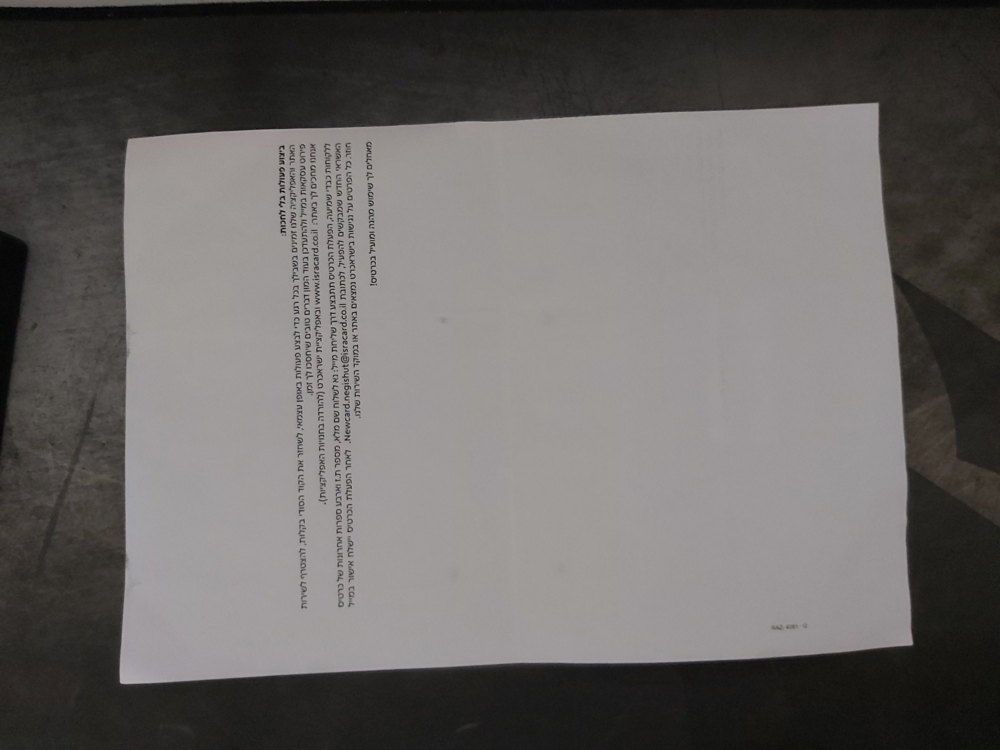

## A Basic Document Scanner
A basic document scanner that scans an image a produces a better readable form of it,using OpenCV and Python

# Input image


# Final Result


# Table of Contents
- General Info
- Installing and running the project on local machine
- Libraries Used
- End Product
- References 

# General Info
A document scanner can be build using basic image processing techniques, inorder to achieve the result

*Usually the process takes only three main process:-*
1. Detect the edge
2. Use the edges in the image to find the contour (outline) representing the piece of paper being scanned.
3. Apply a perspective transform to obtain the top-down view of the document.

# Installing and running the project on local machine
Clone the project
```
git clone https://github.com/...
```
Go to the project directory
```
cd Document_Scanner_OpenCV
```
Run the shell script to install required packages and start the program.
```
./run.sh
```

- If you face any permission errors while running the shell script. Write the given code.
  ```
  chmod +x run.sh
  ```
  This provides you with the execution rights in order to run the script.


Or, Just click on the run.sh file!

# Libraries Used
- OpenCV
- Python3
- numpy

# End Product
I have added a scanned result.

# References
This could have not possible without the help of [pyimagesearch](https://www.pyimagesearch.com/2014/09/01/build-kick-ass-mobile-document-scanner-just-5-minutes/) and [Pysource](https://pysource.com/2018/02/14/perspective-transformation-opencv-3-4-with-python-3-tutorial-13/)